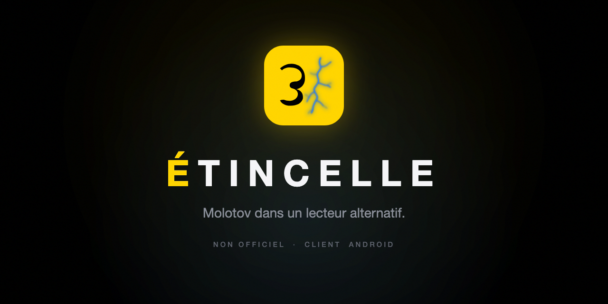
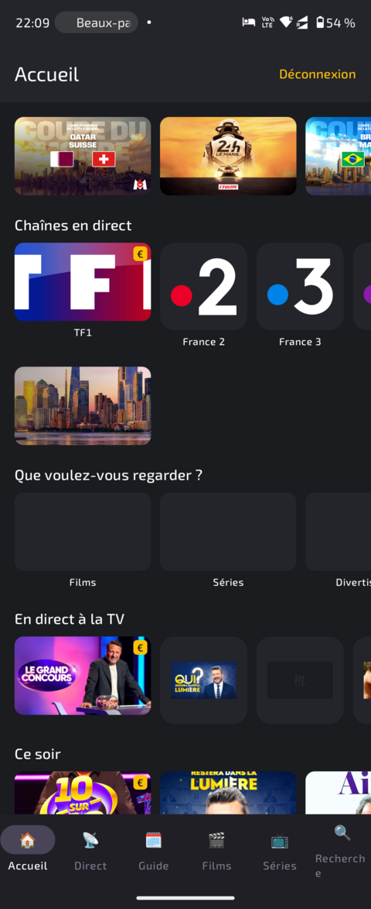
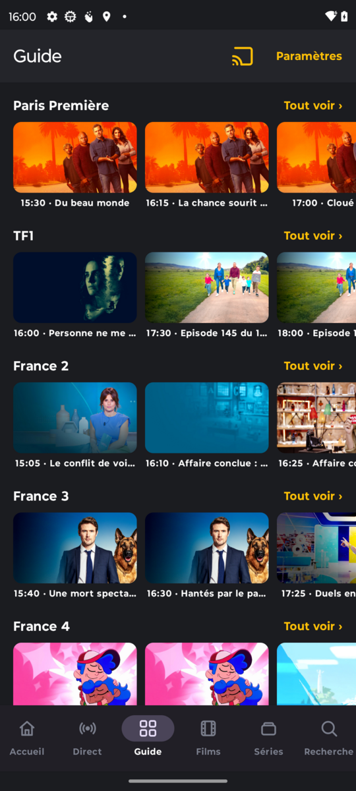
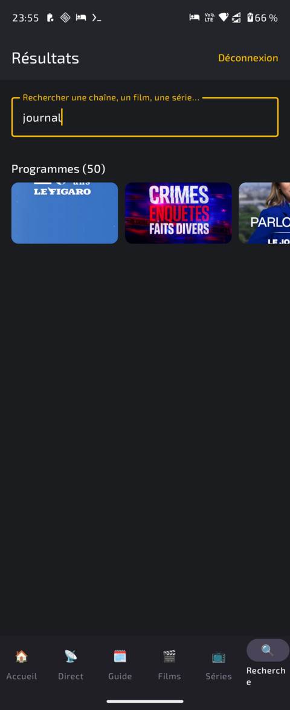
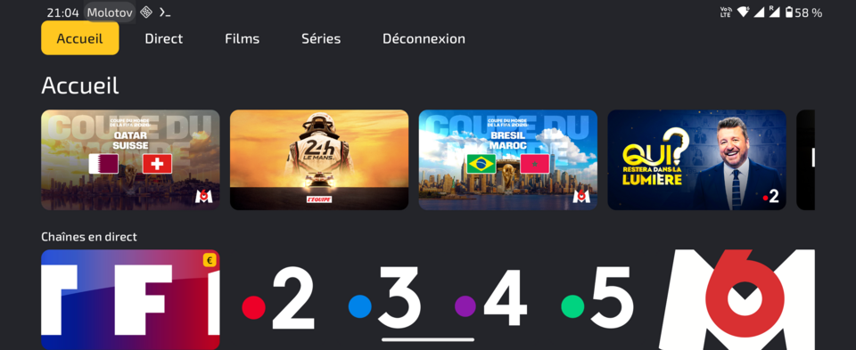

<div align="center">



[](LICENSE)
-3DDC84?logo=android&logoColor=white)


</div>

Application Android native (ciblant **Android 16 / API 36**) pour regarder **Molotov** via le
backend **Fubo** qu'utilise l'application Molotov actuelle (5.51), avec l'apparence de l'ancienne
interface Molotov **4.27**. Elle fonctionne sur **téléphone/tablette** et **Android TV**, et lit les
contenus directement sur l'appareil avec le **DRM Widevine** via AndroidX Media3.

> ### ⚠️ Avertissement
>
> Projet non officiel, sans aucune affiliation avec Molotov ni Fubo. **etincelle** n'est qu'un
> client alternatif : il n'offre aucun accès gratuit, ne partage aucun compte et ne contourne aucune
> protection.
>
> - **Aucun contournement de géo-restriction.** L'application n'embarque ni VPN, ni proxy, ni aucun
>   moyen de masquer ou de falsifier votre localisation. Le backend reste géo-restreint à l'Union
>   européenne : hors de l'UE, le service ne fonctionne pas, et etincelle ne vous aidera d'aucune
>   façon à le débloquer.
> - **Aucun accès sans compte.** Regarder Molotov exige votre propre compte payant valide avec
>   l'option **Molotov Extra** sur Fubo. L'application ne fournit aucun identifiant et ne permet
>   strictement pas de regarder Molotov sans cet abonnement.
>
> Vous restez seul responsable du respect des conditions d'utilisation de Molotov/Fubo et de la
> législation applicable.

## Captures d'écran

Téléphone (Jetpack Compose, Material 3) :

<p align="center">
  
  
  
</p>

Android TV (Compose for TV, navigation D-pad) :

<p align="center">
  
</p>

## État

Application téléphone fonctionnelle. Elle **se connecte au backend Fubo (Molotov), affiche la page
d'accueil** (le catalogue `papi` piloté par le serveur : chaînes en direct avec badges de verrouillage
pour les chaînes payantes, ainsi que « Que voulez-vous regarder ? », « En direct à la TV », etc.) dans
le style sombre de Molotov 4.27, et **lit une chaîne gratuite sur l'appareil** avec le DRM Widevine
(via DRMtoday) grâce à AndroidX Media3, vérifié de bout en bout sur un appareil Android 16. Elle est
**navigable** : onglets de la barre inférieure (Accueil / Direct / Films / Séries) et une pile de
navigation, de sorte que toute carte qui n'est pas une chaîne ouvre sa propre page `papi` (catégories,
« Voir tout », fiche programme/série) rendue avec les mêmes carrousels. Elle lit aussi la **VOD et les
replays** (films et épisodes de séries, via le chemin `type=vod`) et **reprend la lecture là où vous
l'aviez laissée** (la position de lecture est mémorisée localement par titre), et dispose d'un onglet
**Recherche** (`/papi/v1/search`) dont les résultats s'affichent en carrousels. Un onglet **Guide**
affiche l'EPG en direct (`/epg`) : un carrousel par chaîne montrant le programme en cours et les
suivants avec leurs horaires, et toucher un programme lance la chaîne en direct. Sur téléphone, elle
peut **diffuser le flux en cours vers un Chromecast** ou un téléviseur compatible Cast (direct et VOD,
Widevine via DRMtoday) : un bouton dans la barre du haut ouvre la liste des appareils, et choisir
« Cet appareil » ou couper la session ramène la lecture sur le téléphone. Chaque transfert ré-résout
le flux avec des jetons frais (le direct reprend au bord du direct, la VOD à sa position), et un écran
« Lecture sur l'appareil » remplace la vidéo pendant la diffusion ; la diffusion nécessite Google Play
Services, à défaut l'application reste pleinement utilisable en lecture locale. Une application
**Android TV** (Compose for TV : lignes navigables au D-pad, surbrillance du focus, barre d'onglets
défilante avec les mêmes onglets Accueil / Direct / Guide / Films / Séries / Recherche) partage la
même couche données/lecteur. Le contrat complet du backend est décrit dans
[`docs/fubo-api.md`](docs/fubo-api.md). La **session persiste** entre les lancements (DataStore, avec
les jetons d'accès et de rafraîchissement **chiffrés au repos** via AES-GCM et une clé Android
Keystore **adossée au matériel**), le jeton d'accès **se rafraîchit automatiquement** sur un 401, et
les incidents réseau passagers (y compris les `5xx`/`404` intermittents du backend sur un GET) sont
réessayés une fois, les échecs étant présentés par des messages en français clairs plutôt que par des
codes HTTP bruts ; une commande de **déconnexion** sur les deux applications efface la session et
revient à l'écran de connexion. Les enregistrements (DVR) sont reportés : l'endpoint est mappé
(`/dvr/v2/list`, voir la doc d'API), mais le compte de test ne dispose d'aucun droit DVR, donc une
interface d'enregistrements ne peut être construite et vérifiée qu'avec un compte qui en possède un.

## Installation

Téléchargez l'APK signé pour votre appareil depuis la
[dernière version](https://github.com/renaudallard/etincelle/releases/latest) :

- **Téléphone / tablette** : `etincelle-<version>-mobile.apk`
- **Android TV** : `etincelle-<version>-tv.apk`

Les deux fonctionnent sur Android 6.0+ (`minSdk 23`) et sont auto-signés, donc Android vous demande
d'autoriser l'installation depuis une source inconnue. La connexion nécessite un compte payant
**Molotov Extra** sur Fubo et une connexion depuis l'UE.

**Téléphone / tablette**

1. Téléchargez `etincelle-<version>-mobile.apk` sur l'appareil, ou installez-le par USB avec
   `adb install etincelle-<version>-mobile.apk`.
2. Autorisez « Installer des applications inconnues » pour votre navigateur ou gestionnaire de
   fichiers si demandé.
3. Ouvrez **etincelle** et connectez-vous.

**Android TV** (pas de navigateur, à charger en sideload)

- Par adb : `adb connect <ip-tv>` puis `adb install etincelle-<version>-tv.apk`, ou
- copiez l'APK sur une clé USB, ou poussez-le avec un utilitaire de sideload (par ex. *Send files to
  TV*, *Downloader*), puis ouvrez-le.

Les builds téléphone et TV sont des paquets distincts (`it.allard.etincelle` et
`it.allard.etincelle.tv`), vous pouvez donc installer les deux côte à côte. Pour construire les APK
vous-même, voir [Construction](#construction) ci-dessous.

## Architecture du projet

```
etincelle/
├── app-mobile/             application téléphone/tablette (Compose, Material3, Media3)
├── app-tv/                 application Android TV (Compose for TV, navigation + lecture au D-pad)
├── core/
│   ├── designsystem/       jetons du thème sombre Molotov-4.27 + composants Compose partagés
│   ├── model/              types métier en Kotlin pur (PlaybackSource, DrmSpec, UserSession)
│   ├── domain/             l'interface MolotovRepository (abstraction du backend)
│   ├── network/            OkHttp/Retrofit/Moshi + intercepteurs Fubo + session + TokenStore
│   ├── player/             mapping Media3 : DrmSpec vers MediaItem Widevine
│   └── ui/                 MainViewModel/UiState partagés (logique de présentation des deux apps)
├── data/
│   └── fubo/               FuboRepository (implémente MolotovRepository) + DTO/mappers + DI
└── gradle/libs.versions.toml   catalogue de versions
```

Les deux applications affichent le même catalogue `papi` et lisent les mêmes flux ; seule la couche UI
Compose diffère (Material3 + barre inférieure sur téléphone, lignes Compose-for-TV + focus D-pad sur
TV). La couche de présentation (`core:ui`) ne dépend que de l'interface `MolotovRepository` de
`core:domain`, le backend reste donc interchangeable. Les tests unitaires couvrent les intercepteurs,
les mappers DTO vers métier/DRM et le rafraîchissement des jetons. L'injection de dépendances est un
petit `AppContainer` manuel (Hilt serait surdimensionné pour une application à un seul ViewModel et un
seul backend ; il pourra être ajouté si le graphe grandit).

## Construction

Prérequis sur la machine de build :

- Android SDK avec `platforms;android-36` et `build-tools;36.0.0`
  (`sdkmanager "platforms;android-36" "build-tools;36.0.0"`).
- **JDK 21** pour Gradle (AGP 8.x ne supporte pas le JDK 25). Le JDK du daemon Gradle est fixé dans
  `gradle.properties` via `org.gradle.java.home` ; adaptez le chemin à votre machine.
- Le wrapper Gradle (Gradle 8.x) est versionné ; utilisez `./gradlew`, pas un Gradle système.

```bash
./gradlew :app-mobile:assembleDebug      # APK debug téléphone/tablette
./gradlew :app-tv:assembleDebug          # APK debug Android TV
```

Indiquez l'emplacement du SDK dans `local.properties` (`sdk.dir=/chemin/vers/Android/Sdk`).

## Chaîne d'outils

Kotlin 2.4, AGP 8.12, Gradle 8.x, Jetpack Compose (BOM 2026.05), Compose for TV (`androidx.tv`),
AndroidX Media3 (ajouté lors du jalon de lecture). `compileSdk`/`targetSdk` = 36, `minSdk` = 23.

## Licence

BSD 2-Clause. Voir [LICENSE](LICENSE).
